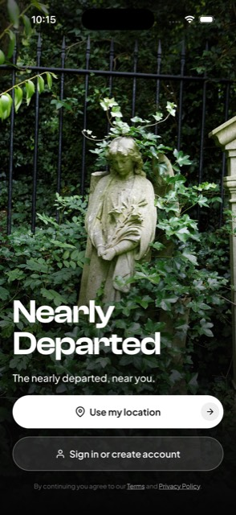
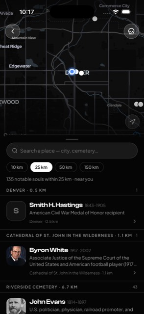
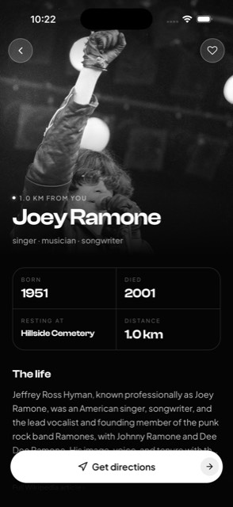

# Nearly Departed

Who's buried near you, and why did they matter? Discovery-first, story-first — the inverse of search-first apps like Find a Grave.

<p>
  
  
  
</p>

## Features

- **Discover** — nearby notable dead within a chosen radius (10 / 25 / 50 / 150 km), grouped by cemetery on a map and in a list
- **Search anywhere** — drop the radius on any place in the world, not just your current location
- **Person detail** — bio, dates, occupations, and a Wikipedia summary per soul
- **Favorites** — save people locally, works offline, no account required
- **Auth** — optional passwordless email OTP or Sign in with Apple (for syncing favorites later)
- **Localized results** — SPARQL query returns labels in the device language, falling back to English

## Data sources

No API keys required — all public, unauthenticated endpoints:

- **Wikidata SPARQL** (`query.wikidata.org`) — burial place (P119) + coordinates (P625) via `wikibase:around`; nearest-150 subquery first, then enrich, to keep dense-city queries fast
- **Wikipedia REST summary API** — bio text for the person detail screen
- **Photon** (komoot, OpenStreetMap-based) — geocoding for "search anywhere"

## Tech stack

- [Expo](https://expo.dev) SDK 56 (React Native 0.85, CNG — `ios`/`android` are generated, not hand-edited)
- [expo-router](https://docs.expo.dev/router/introduction/) (typed routes) + TypeScript
- [NativeWind](https://www.nativewind.dev/) (Tailwind for React Native)
- [TanStack Query](https://tanstack.com/query) for data fetching/caching
- [MapLibre](https://github.com/maplibre/maplibre-react-native) (`@maplibre/maplibre-react-native`), CARTO dark-matter style
- `expo-location` for device location
- [Supabase](https://supabase.com) — passwordless email OTP + Apple sign-in
- AsyncStorage-backed local favorites behind a `FavoritesRepository` interface (`src/lib/favorites/`) — swappable for a Supabase-backed implementation later without touching call sites

## Getting started

```bash
npm install
npx expo start --dev-client
```

Expo Go will not work — this app has native modules (MapLibre, Apple auth). You need a dev client build first (see below).

## Building for iOS

```bash
export LANG=en_US.UTF-8 LC_ALL=en_US.UTF-8
RCT_USE_PREBUILT_RNCORE=0 RCT_USE_RN_DEP=1 npx expo run:ios
```

Notes:

- The project path must contain **no spaces** — the React Native prebuilt-artifact download breaks otherwise.
- After adding any native module, run `npx expo prebuild --no-install` and `pod install` before `run:ios`.
- Day-to-day loop once a dev client is installed: `npx expo start --dev-client`.

## Project structure

```
src/app/           expo-router routes (index, explore, person/[qid], auth, profile, legal/)
src/components/    UI components (soul-card, souls-map, place-search, ...)
src/lib/           wikidata.ts, wikipedia.ts, geocode.ts, supabase.ts, favorites/
src/hooks/         use-nearby-souls, use-device-location, use-theme
legal/             source markdown for privacy policy + terms (synced into the app — see scripts/sync-legal.mjs)
```

## Scripts

- `npm run ios` / `npm run android` — native builds (run the sync-legal prestep automatically)
- `npm run web` — Expo web
- `npm test` — vitest, logic-only tests (`src/**/*.test.ts`; wikidata, geocode, favorites)
- `npm run test:watch`
- `npm run lint` — `expo lint`

## Legal

Privacy policy, terms of service, and support are also published at [nearly-departed-promo.pages.dev](https://nearly-departed-promo.pages.dev):

- [Privacy policy](https://nearly-departed-promo.pages.dev/privacy)
- [Terms of service](https://nearly-departed-promo.pages.dev/terms)
- [Support](https://nearly-departed-promo.pages.dev/support)

Source markdown lives in `legal/` and is synced into `src/content/legal.ts` for the in-app screens (`src/app/legal/`) by `scripts/sync-legal.mjs`.

## License

Proprietary — copyright (c) 2026 Mia Dugas, all rights reserved. See [LICENSE](LICENSE).
